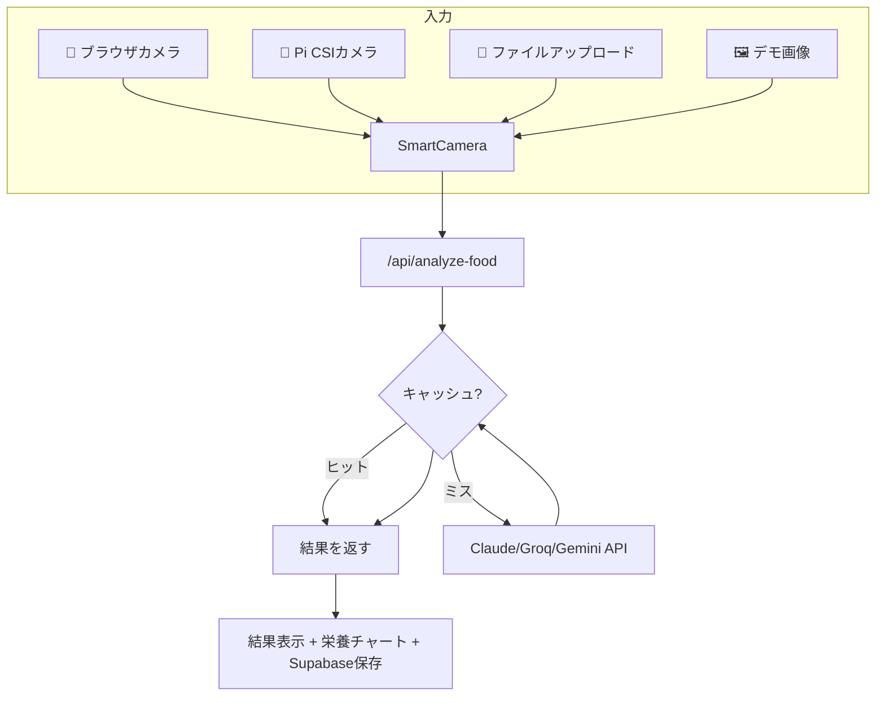

# Nutrition Fitness App — AI搭載フードスキャナー

AIによる食品認識アプリ。**Raspberry PiのCSIカメラ**にネイティブ対応、キッチンにPiを置くだけでスマホ不要の栄養管理が可能です。

[GitHub](https://github.com/bengbcit/Nutrition-App) | Vercel対応

## 機能

- 📸 ブラウザカメラ / Piカメラ / ファイルアップロードの3経路で写真入力
- 🤖 AIが食品を自動認識 → カロリー・タンパク質・炭水化物・脂質を算出
- 📊 マクロ栄養素の可視化チャート
- 📅 日別の摂取サマリーと履歴管理
- 🥧 Raspberry PiのCSIカメラにネイティブ対応
- 💾 Supabaseで永続化（未設定時はlocalStorageに自動フォールバック）

## 技術スタック

| レイヤー | 技術 |
|---------|------|
| フレームワーク | Next.js 16 (App Router) + React 19 |
| 言語 | TypeScript 5 |
| スタイリング | Tailwind CSS 4 |
| AIプロバイダー | Claude / Groq / NVIDIA / Gemini |
| データベース | Supabase (PostgreSQL + Storage) · localStorage自動フォールバック |
| デプロイ | Vercel + Raspberry Pi ローカル |

## アーキテクチャ



## クイックスタート

```bash
npm install
# .env.example → .env.local にコピー、ANALYSIS_PROVIDER=mock
npm run dev        # http://localhost:3000
npm run dev:https  # HTTPS（ブラウザカメラに必須）
```

## Supabaseセットアップ（5分）

1. [supabase.com](https://supabase.com) でプロジェクト作成
2. SQL Editor → `supabase-init.sql` を実行
3. Storage → `food-photos` バケット作成（public）
4. `.env.local` に追加：
```bash
SUPABASE_URL=https://xxxxx.supabase.co
SUPABASE_SERVICE_ROLE_KEY=sb_secret_xxxxxxxxxxxx
```

## 主要な設計判断

- **video要素を常にDOMに配置**: 条件付きレンダリングによる `videoRef.current === null` バグを `className="hidden"` で解決
- **LRUキャッシュ**: SHA-256ハッシュ → 10分TTL → 最大100件。同じ写真は再分析しない
- **マルチプロバイダー**: 統一 `ANALYSIS_PROMPT` + route handler内のswitch文
- **グレースフルデグラデーション**: Supabase未設定 → 自動でlocalStorageにフォールバック
- **Piカメラブリッジ**: `rpicam-still` を `child_process.exec` で実行、`Image.onload` でちらつき防止
