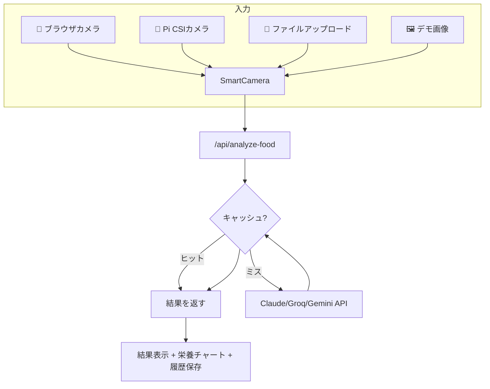

## はじめに

食事の栄養管理、面倒ですよね。写真を撮るだけでAIが自動で食品を認識し、カロリーや栄養素を計算してくれるアプリを作りました。しかも**Raspberry PiのCSIカメラ**にも対応。キッチンにPiを置いておけば、スマホ不要でサッと撮影→分析できます。

ソースコードは [GitHub](https://github.com/bengbcit/Nutrition-App) で公開中。Vercelへのデプロイも一発です。

## デモ


主な機能：
- 📸 ブラウザカメラ / Piカメラ / ファイルアップロードの3経路で写真入力
- 🤖 AIが食品を自動認識 → カロリー・タンパク質・炭水化物・脂質を算出
- 📊 マクロ栄養素の可視化チャート
- 📅 日別の摂取サマリーと履歴管理
- 🥧 Raspberry PiのCSIカメラにネイティブ対応

## 技術スタック

| レイヤー | 技術 |
|---------|------|
| フレームワーク | Next.js 16 (App Router) + React 19 |
| 言語 | TypeScript 5 |
| スタイリング | Tailwind CSS 4 |
| AIプロバイダー | Claude (Anthropic) / Groq / NVIDIA / Gemini 🌐 |
| データベース | Supabase (PostgreSQL + Storage) · localStorage自動フォールバック |
| デプロイ | Vercel + Raspberry Pi ローカル |

## アーキテクチャ



## 3つの撮影方法

### 1. ブラウザカメラ（`Camera.tsx`）

`getUserMedia()` APIでブラウザのカメラにアクセス。**最初の実装では `videoRef.current` が `null` で動かないバグ**がありました。原因は `<video>` 要素が条件付きレンダリングされていたため、`startCamera()` 実行時にはまだDOMに存在しなかったこと。対策として `<video>` を常にDOMに置き、`className="hidden"` で表示/非表示を切り替える方式に修正しました。

```typescript
// ❌ ダメなパターン: video要素が条件付きレンダリング
{isCameraActive ? <video ref={videoRef} ... /> : <button>Start</button>}

// ✅ 修正後: 常にDOMに存在、CSSで表示切替
<video ref={videoRef} className={isCameraActive ? "block" : "hidden"} ... />
```

### 2. Pi CSIカメラ（`PiCamera.tsx` + `/api/preview`, `/api/capture`）

Raspberry Pi専用。`rpicam-still` コマンドをサーバーサイドで実行し、500ms間隔でプレビュー画像を取得→`` で表示しています。撮影時は wait を入れてから高解像度キャプチャを実行。

```typescript
// プレビューループ: 前のフレーム読み込み完了を待ってから次を要求
const fetchNextFrame = async () => {
  const img = new Image();
  img.onload = () => setPreviewUrl(url);  // 読み込み完了してから更新
  img.src = `/api/preview?t=${Date.now()}`;
  timeoutId = setTimeout(fetchNextFrame, 100);
};
```

### 3. SmartCamera — 自動検出

`/api/camera-status` エンドポイントで `rpicam-hello --list-cameras` を実行し、CSIカメラの有無を自動判定。Piカメラがあれば `PiCamera`、なければ `Camera` を自動選択。手動切り替えボタンも完備。

## AI分析エンジン

`/api/analyze-food` は**マルチプロバイダー対応**。環境変数 `ANALYSIS_PROVIDER` で切り替え可能：

```bash
ANALYSIS_PROVIDER=claude   # Anthropic Claude
ANALYSIS_PROVIDER=groq     # Groq (高速推論)
ANALYSIS_PROVIDER=gemini   # Google Gemini
ANALYSIS_PROVIDER=mock     # モック（APIキー不要、開発用）
```

### パフォーマンス最適化

- **LRUキャッシュ**: SHA-256ハッシュをキーに分析結果を10分間メモリキャッシュ。同じ画像の再分析を防止（最大100エントリ）
- **タイムアウト制御**: 30秒でAbortControllerによりタイムアウト
- **画像圧縮**: 最大辺1280px、JPEG品質85%にリサイズしてからAPI送信

```typescript
// キャッシュのキーはSHA-256ハッシュ
const key = createHash('sha256').update(base64Image).digest('hex').substring(0, 16);
const cached = getCached(key);  // ヒットすればAPI呼び出しスキップ
```

## Supabase による永続化

分析結果と写真は **Supabase** に保存されます。未設定時は自動的に `localStorage` へフォールバックするため、ローカル開発中も問題なく動作します。

| 保存対象 | 保存先 | 
|---------|--------|
| 分析履歴（食品名・カロリー・栄養素） | Supabase PostgreSQL (`analyses` テーブル) |
| 撮影写真 | Supabase Storage (`food-photos` バケット) |
| フォールバック | ブラウザの `localStorage` |

```typescript
// サービス側：lib/supabase.ts
export async function uploadImage(base64: string, recordId: string) {
  const buffer = Buffer.from(base64, 'base64');
  await supabase.storage.from('food-photos').upload(`${recordId}.jpg`, buffer);
  return supabase.storage.from('food-photos').getPublicUrl(`${recordId}.jpg`);
}

// クライアント側：自動フォールバック
export async function loadHistoryRemote() {
  try {
    return await fetch('/api/history').then(r => r.json());
  } catch {
    return loadHistoryLocal();  // Supabase未設定→localStorageへ
  }
}
```

セットアップは `supabase-init.sql` を SQL Editor で実行し、Storage Bucket を作成するだけの5分で完了します。

## フロントエンド設計

```typescript
// page.tsx: 全コンポーネントの親
<SmartCamera onCapture={handleCapture} />  // カメラ入力
<DemoImages onSelect={handleCapture} />    // デモ画像
<ImageUploader onCapture={...} />          // アップロード（モーダル表示）

// 分析後
<ResultDisplay result={result} />          // 食品名 + カロリー
<NutritionChart nutrition={result.nutrition} />  // マクロ円グラフ
<AnalysisHistory records={history} />      // 履歴一覧 + 日別集計
```

すべて `'use client'` のクライアントコンポーネント。状態管理はReactの `useState` のみで、外部ライブラリ不要。

## Raspberry Pi対応のポイント

| 課題 | 対策 |
|------|------|
| CSIカメラの検出 | `rpicam-hello --list-cameras` の出力を正規表現で判定 |
| プレビューのチラつき | `Image.onload` 完了後に `src` 更新 |
| 撮影時のカメラ占有競合 | プレビュー停止後600ms待ってからキャプチャ |
| キャッシュ | camera-status を30秒キャッシュ（頻繁に変わらない） |
| LAN内アクセス | `allowedDevOrigins: ['192.168.1.*']` で許可 |

## まとめ

Next.js + TypeScript + AI API で、実用的な栄養分析アプリをフルスタックで構築しました。ポイントは：

1. **複数のAIプロバイダーを統一インターフェースで扱う**設計
2. **Raspberry PiのCSIカメラをWebアプリから操作**するブリッジ
3. **キャッシュとタイムアウト**でAPIコストと応答速度を最適化
4. **Tailwind CSSのみでUI完結**（コンポーネントライブラリ不要）

Pi + CSIカメラのセットアップ方法やVercelへのデプロイ手順は[GitHubのREADME](https://github.com/bengbcit/Nutrition-App)に詳しく書いてあります。ぜひキッチンに一台、栄養管理Piを置いてみてください🍎
